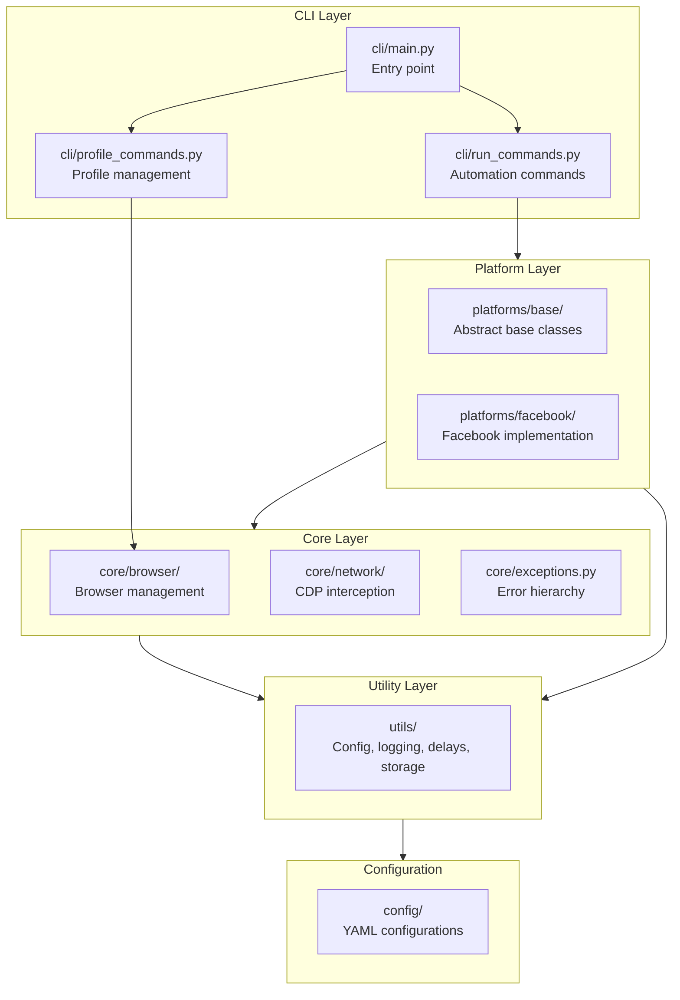
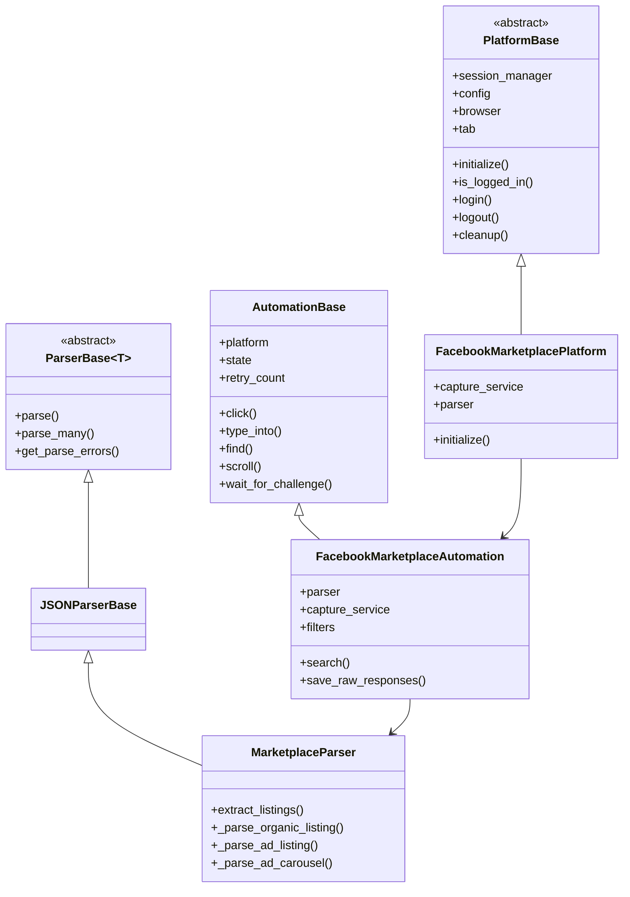
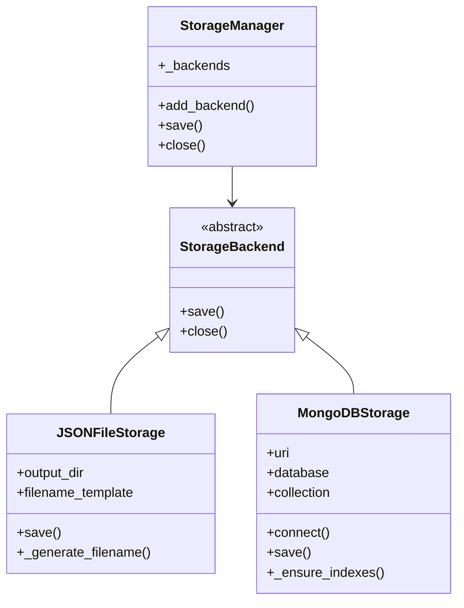
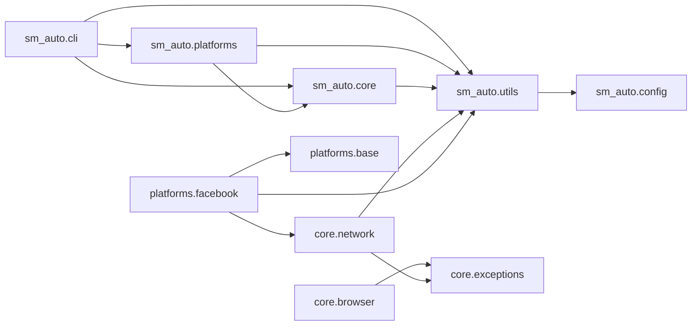

# SM-Auto Complete Codebase Analysis

**Framework:** Universal Web Automation Framework  
**Version:** 0.1.0  
**Language:** Python 3.10+  
**Built On:** nodriver (Chrome DevTools Protocol)  
**Analysis Date:** 2026-03-04

---

## Table of Contents

1. [Project Overview](#1-project-overview)
2. [Architecture Overview](#2-architecture-overview)
3. [Complete Module Inventory](#3-complete-module-inventory)
4. [Class Hierarchy](#4-class-hierarchy)
5. [Import Dependencies](#5-import-dependencies)
6. [Bugs & Issues Found](#6-bugs--issues-found)
7. [Cleanup Recommendations](#7-cleanup-recommendations)
8. [Refactor Plan](#8-refactor-plan)
9. [Testing Analysis](#9-testing-analysis)
10. [Dependencies Analysis](#10-dependencies-analysis)

---

## 1. Project Overview

SM-Auto is an async Python framework for web automation built on nodriver. It uses Chrome DevTools Protocol (CDP) for network interception and browser control. The framework supports multi-platform automation with a plugin architecture.

### Key Features
- Profile-based automation using existing Chrome profiles
- CDP network interception for API traffic capture
- Human-like behavior simulation with variable delays
- Multi-storage backends (JSON, MongoDB)
- Extensible platform architecture

---

## 2. Architecture Overview



---

## 3. Complete Module Inventory

### 3.1 Core Package (`sm_auto/`)

| Module | Lines | Purpose | Status |
|--------|-------|---------|--------|
| `__init__.py` | 9 | Package init, version info | Clean |

### 3.2 CLI Package (`sm_auto/cli/`)

| Module | Lines | Purpose | Issues |
|--------|-------|---------|--------|
| `__init__.py` | 0 | Empty init | None |
| `main.py` | 190 | Main CLI entry point | Missing type hints for callbacks |
| `profile_commands.py` | 410 | Profile management commands | Missing type hints |
| `run_commands.py` | 430 | Automation run commands | Missing type hints |

**Functions in CLI:**

#### `cli/main.py`
- `get_profile_manager_with_config()` - Get ProfileManager with config
- `cli()` - Main CLI group
- `list_platforms()` - List supported platforms
- `auth()` - Interactive authentication

#### `cli/profile_commands.py`
- `profile()` - Profile command group
- `get_profile_manager_with_config()` - Factory function
- `list_profiles()` - List Chrome profiles
- `detect_profiles()` - Auto-detect Chrome directories
- `verify_profile()` - Verify profile integrity
- `copy_profile()` - Copy a profile
- `clean_profiles()` - Clean old profile copies
- `profile_info()` - Show profile details

#### `cli/run_commands.py`
- `run()` - Run command group
- `_sanitize_filename()` - Sanitize filenames
- `facebook_marketplace()` - Run marketplace search
- `test()` - Test automation

### 3.3 Core Package (`sm_auto/core/`)

| Module | Lines | Purpose | Issues |
|--------|-------|---------|--------|
| `__init__.py` | 35 | Exception exports | Clean |
| `exceptions.py` | 107 | Error hierarchy | DUPLICATE CLASS DEFINITION |

#### Core Exceptions (`sm_auto/core/exceptions.py`)

**Exception Hierarchy:**
```
SMAutoError (base)
├── BrowserError
│   ├── BrowserLaunchError
├── ProfileError
│   ├── ProfileNotFoundError (DEFINED TWICE!)
│   ├── ProfileLockedError
│   ├── ProfileCopyError
│   └── ChromeInstallationNotFoundError
├── NetworkError
│   └── NetworkInterceptionError
├── CaptchaError
│   └── ChallengeDetectedError
├── PlatformError
│   └── PlatformNotFoundError
├── AutomationError
│   ├── ElementNotFoundError
│   └── ElementInteractionError
├── ParserError
│   └── ParseValidationError
├── SessionError
│   └── SessionExpiredError
└── RateLimitError
```

**CRITICAL BUG:** `ProfileNotFoundError` is defined twice:
- Line 33: For "profile not found within Chrome installation"
- Line 51: For "Chrome installation not found" (should be `ChromeInstallationNotFoundError`)

### 3.4 Core Browser (`sm_auto/core/browser/`)

| Module | Lines | Classes | Functions |
|--------|-------|---------|-----------|
| `driver_factory.py` | 130 | `DriverFactory` | `create()` |
| `profile_manager.py` | 550 | `ChromeProfile`, `ChromeUserDataDir`, `ProfileManager` | `discover_profiles()`, `verify_profile()`, `copy_profile()` |
| `session_manager.py` | 330 | `SessionManager` | `start()`, `stop()`, `get_tab()`, `save_cookies()`, `load_cookies()` |

**Classes:**

#### `ChromeProfile` (dataclass)
```python
@dataclass
class ChromeProfile:
    name: str
    path: Path
    is_default: bool = False
    last_used: Optional[str] = None
    display_name: Optional[str] = None
    email: Optional[str] = None
```

#### `ChromeUserDataDir` (dataclass)
```python
@dataclass
class ChromeUserDataDir:
    path: Path
    is_default: bool = False
    browser_name: str = "Chrome"
    profiles: List[ChromeProfile] = field(default_factory=list)  # Fixed pattern
```

#### `ProfileManager`
- `CHROME_USER_DATA_DIRS` - Dict of OS-specific paths
- `discover_profiles()` / `discover_profiles_sync()`
- `detect_all_chrome_dirs()`
- `verify_profile()` / `verify_profile_sync()`
- `copy_profile()` / `copy_profile_sync()`
- `_read_preferences()` / `_read_preferences_async()`

### 3.5 Core Network (`sm_auto/core/network/`)

| Module | Lines | Classes | Key Methods |
|--------|-------|---------|-------------|
| `models.py` | 145 | 8 models | Pydantic models for network data |
| `cdp_interceptor.py` | 350 | `CDPInterceptor` | `start()`, `stop()`, `_on_response_received()` |
| `capture_service.py` | 320 | `CaptureService` | `start()`, `stop()`, `register_parser()` |

**Models in `models.py`:**
- `RequestData` - HTTP request representation
- `ResponseData` - HTTP response representation
- `RequestEvent` - CDP request event
- `ResponseEvent` - CDP response event
- `GraphQLRequest` - GraphQL-specific request
- `GraphQLResponse` - GraphQL-specific response
- `NetworkCaptureEvent` - Combined capture event
- `WebSocketEvent` - WebSocket frame event

**BUG in `cdp_interceptor.py`:** Line 249 has a debug print statement:
```python
print(f"[CDP] Pushing response to queue: {url}, body length: {len(body) if body else 0}")  # Debug
```

### 3.6 Platforms Base (`sm_auto/platforms/base/`)

| Module | Lines | Classes |
|--------|-------|---------|
| `platform_base.py` | 145 | `PlatformConfig`, `PlatformBase` |
| `automation_base.py` | 380 | `AutomationState`, `AutomationBase` |
| `parser_base.py` | 190 | `ParserBase`, `JSONParserBase`, `HTMLParserBase` |

**AutomationState Enum:**
```python
class AutomationState(Enum):
    INITIALIZING = auto()
    AT_HOME = auto()
    NAVIGATING = auto()
    POPUP_BLOCKING = auto()
    TASK_RUNNING = auto()
    CHALLENGE_PRESENT = auto()
    COOLDOWN = auto()
    ERROR = auto()
    COMPLETED = auto()
```

**AutomationBase Methods:**
- `click()` - Human-like click
- `type_into()` - Human-like typing
- `find()` - Find element with timeout
- `scroll()` - Scroll page
- `wait_for_challenge()` - CAPTCHA detection
- `handle_popup()` - Popup handling
- `human_type()` - Type with variable speed
- `human_click()` - Click with random offsets
- `human_scroll()` - Scroll with variable speed

### 3.7 Facebook Platform (`sm_auto/platforms/facebook/`)

| Module | Lines | Classes |
|--------|-------|---------|
| `marketplace/models.py` | 260 | 7 models |
| `marketplace/parser.py` | 450 | `MarketplaceParser` |
| `marketplace/automation.py` | 700 | `FacebookMarketplaceConfig`, `FacebookMarketplaceAutomation` |

**Models in `models.py`:**
- `MarketplaceListing` - Main listing model
- `MarketplaceSearchResult` - Search results container
- `MarketplaceFeedItem` - Feed item
- `MarketplaceCategory` - Category info
- `MarketplaceSeller` - Seller info
- `MarketplaceImage` - Image data
- `SearchFilters` - Search filter options

**MarketplaceListing Fields:**
```python
- type: str ("organic", "ad", "ad_carousel")
- id: str
- title: str
- price: Optional[str]
- location: Optional[str]
- image_url: Optional[str]
- seller_name: Optional[str]
- seller_id: Optional[str]
- url: str
- scraped_at: datetime
- extra_data: Optional[Dict]
- is_sold: Optional[bool]      # NEW
- is_pending: Optional[bool]   # NEW
- is_hidden: Optional[bool]    # NEW
- category_id: Optional[str]   # NEW
- price_numeric: Optional[float]  # NEW
- delivery_types: List[str]    # NEW
- price_converted: Optional[str]  # NEW
```

### 3.8 Utilities (`sm_auto/utils/`)

| Module | Lines | Purpose |
|--------|-------|---------|
| `config.py` | 350 | Pydantic settings management |
| `delays.py` | 280 | Human-like delay functions |
| `logger.py` | 160 | Colored logging setup |
| `security.py` | 180 | Path validation, sanitization |
| `selectors.py` | 230 | YAML selector loading |

**Config Classes in `config.py`:**
- `BrowserConfig` - Browser settings
- `ProfileConfig` - Profile settings
- `DelayConfig` - Delay timing settings
- `NetworkConfig` - Network interception settings
- `PlatformConfig` - Per-platform settings
- `StorageConfig` - Storage backend settings
- `MongoDBConfig` - MongoDB-specific settings
- `JSONConfig` - JSON file settings
- `LoggingConfig` - Logging settings
- `Settings` - Root configuration

**Delay Functions in `delays.py`:**
- `micro_delay()` - 80-200ms
- `action_delay()` - 0.5-2.5s
- `task_delay()` - 2-8s
- `page_delay()` - 1.5-4s
- `reading_pause()` - 3-12s
- `session_gap()` - 5-15s
- `human_type()` - Type with WPM simulation
- `human_click()` - Click with offset
- `human_scroll()` - Scroll with variable speed
- `random_think_pause()` - Random pause

### 3.9 Storage (`sm_auto/utils/storage/`)

| Module | Lines | Classes |
|--------|-------|---------|
| `base.py` | 20 | `StorageBackend` (ABC) |
| `json_storage.py` | 60 | `JSONFileStorage` |
| `mongodb_storage.py` | 120 | `MongoDBStorage` |
| `__init__.py` | 90 | `StorageManager` |

### 3.10 Configuration Files (`sm_auto/config/`)

| File | Purpose |
|------|---------|
| `default_config.yaml` | Default configuration values |
| `facebook_selectors.yaml` | Facebook-specific CSS selectors |

### 3.11 Examples (`sm_auto/examples/`)

| Module | Purpose |
|--------|---------|
| `facebook_marketplace.py` | Complete marketplace automation example |

### 3.12 Tests (`tests/`)

| Module | Lines | Coverage |
|--------|-------|----------|
| `conftest.py` | 45 | Fixtures |
| `test_delays.py` | 110 | Delay functions |
| `test_exceptions.py` | 95 | Exception classes |
| `test_marketplace_models.py` | 450 | Marketplace models |
| `test_marketplace_parser.py` | 690 | Marketplace parser |
| `test_raw_response_saving.py` | 570 | Raw response saving |
| `test_mongodb_indexes.py` | 620 | MongoDB storage |
| `test_security.py` | 180 | Security utilities |
| `test_selectors.py` | 110 | Selector loading |

---

## 4. Class Hierarchy

### 4.1 Platform Architecture



### 4.2 Storage Architecture



---

## 5. Import Dependencies

### 5.1 External Dependencies

| Package | Usage | Version |
|---------|-------|---------|
| `nodriver` | Browser automation | >=0.48.0 |
| `pydantic` | Data validation | >=2.0.0 |
| `pyyaml` | Config loading | >=6.0 |
| `click` | CLI framework | >=8.0.0 |
| `aiofiles` | Async file I/O | >=23.0.0 |
| `beautifulsoup4` | HTML parsing | >=4.12.0 |
| `motor` | Async MongoDB | >=3.3.0 |
| `python-dotenv` | Environment vars | >=1.0.0 |

### 5.2 Internal Import Graph



---

## 6. Bugs & Issues Found

### 6.1 Critical Issues (Fix Immediately)

#### BUG-001: Duplicate Exception Definition
**File:** `sm_auto/core/exceptions.py`  
**Lines:** 33-36 and 51-54

```python
# Line 33 - First definition
class ProfileNotFoundError(ProfileError):
    """Raised when a requested Chrome profile is not found within a Chrome installation."""
    pass

# Line 51 - DUPLICATE! Overwrites first
class ProfileNotFoundError(ProfileError):
    """Raised when Chrome installation is not found."""
    pass
```

**Impact:** The second definition overwrites the first, causing loss of the "profile not found" exception behavior.

**Fix:** Rename second class to `ChromeInstallationNotFoundError`.

#### BUG-002: Debug Print in Production Code
**File:** `sm_auto/core/network/cdp_interceptor.py`  
**Line:** 249

```python
print(f"[CDP] Pushing response to queue: {url}, body length: {len(body) if body else 0}")  # Debug
```

**Impact:** Pollutes stdout in production.

**Fix:** Replace with `logger.debug()` or remove.

### 6.2 Medium Priority Issues

#### ISSUE-003: Missing Type Hints in CLI
**Files:** All CLI modules

Most CLI command functions lack type hints for parameters and return types.

#### ISSUE-004: Inefficient Settings Loading
**File:** `sm_auto/utils/delays.py`

Settings are loaded from scratch on every delay call. Should be cached.

**Current:**
```python
async def micro_delay():
    from sm_auto.utils.config import get_settings
    settings = get_settings()  # Loaded every time!
```

#### ISSUE-005: Synchronous File I/O in Async Context
**File:** `sm_auto/core/browser/profile_manager.py`

Profile discovery uses blocking file I/O:
```python
with open(preferences_file, "r") as f:
    prefs = json.load(f)
```

Should use `aiofiles`.

### 6.3 Low Priority Issues

#### ISSUE-006: Hardcoded Selectors
**File:** `sm_auto/platforms/facebook/marketplace/automation.py`

Facebook selectors are hardcoded in the Python file:
```python
FACEBOOK_SELECTORS = {
    "search_input": 'input[aria-label="Search Marketplace"]',
    ...
}
```

Should be loaded from external YAML configuration for easier updates.

#### ISSUE-007: Inconsistent Import Ordering
Some files have mixed import ordering (stdlib, third-party, local).

#### ISSUE-008: Mutable Default Pattern (Already Fixed)
**File:** `sm_auto/core/browser/profile_manager.py`

Uses `__post_init__` to handle None default. Could use `field(default_factory=list)`.

---

## 7. Cleanup Recommendations

### 7.1 Code Style Cleanup

| Task | Files | Priority |
|------|-------|----------|
| Add type hints to CLI | `cli/*.py` | High |
| Fix import ordering | Multiple | Medium |
| Add docstrings | CLI commands | Medium |
| Remove unused imports | All files | Low |

### 7.2 Performance Cleanup

| Task | Files | Impact |
|------|-------|--------|
| Cache settings | `utils/delays.py` | High |
| Async file I/O | `core/browser/profile_manager.py` | Medium |
| Connection pooling | `core/network/cdp_interceptor.py` | Low |

### 7.3 Security Cleanup

| Task | Files | Impact |
|------|-------|--------|
| Add path validation | `cli/profile_commands.py` | High |
| Sanitize log output | `core/browser/driver_factory.py` | Medium |
| Validate URLs | `utils/security.py` | Medium |

---

## 8. Refactor Plan

### Phase 1: Critical Bug Fixes (Priority 1)

1. **Fix Duplicate Exception** (`exceptions.py`)
   - Rename second `ProfileNotFoundError` to `ChromeInstallationNotFoundError`
   - Update all imports/references

2. **Remove Debug Print** (`cdp_interceptor.py`)
   - Replace with logger.debug()

### Phase 2: Type Safety (Priority 2)

1. Add type hints to all CLI functions
2. Add return type hints to all public methods
3. Fix mypy configuration to be stricter

### Phase 3: Performance (Priority 3)

1. Implement settings caching in `delays.py`
2. Convert profile manager to async file I/O
3. Add connection pooling for MongoDB

### Phase 4: Architecture Improvements (Priority 4)

1. **Extract Selectors to Config**
   - Move hardcoded selectors to YAML
   - Implement selector versioning
   - Add fallback chains

2. **Improve Error Handling**
   - Add retry logic with exponential backoff
   - Better error messages for common failures

3. **Add Metrics/Monitoring**
   - Success/failure rates
   - Timing metrics
   - Error tracking

### Phase 5: Testing (Priority 5)

1. Add tests for untested modules:
   - Profile manager
   - Network interception
   - CLI commands

2. Increase test coverage to 80%+

---

## 9. Testing Analysis

### 9.1 Current Test Coverage

| Component | Tests | Coverage | Risk |
|-----------|-------|----------|------|
| Exceptions | Yes | High | Low |
| Delays | Yes | High | Low |
| Security | Yes | Medium | Low |
| Selectors | Yes | Medium | Low |
| Marketplace Models | Yes | High | Low |
| Marketplace Parser | Yes | High | Low |
| MongoDB Storage | Yes | High | Low |
| Raw Response Saving | Yes | High | Low |
| Profile Manager | No | None | HIGH |
| Network Interception | No | None | HIGH |
| CLI Commands | No | None | MEDIUM |

### 9.2 Missing Tests

1. **Profile Manager Tests**
   - Profile discovery
   - Profile verification
   - Profile copying
   - Error handling

2. **Network Interception Tests**
   - CDP event handling
   - Response capture
   - Queue management

3. **CLI Tests**
   - Command parsing
   - Error handling
   - Integration tests

---

## 10. Dependencies Analysis

### 10.1 Production Dependencies

```
nodriver>=0.48.0       # Core browser automation
pydantic>=2.0.0        # Data validation
pyyaml>=6.0            # Configuration
click>=8.0.0           # CLI framework
aiofiles>=23.0.0       # Async file operations
beautifulsoup4>=4.12.0 # HTML parsing
motor>=3.3.0           # Async MongoDB
python-dotenv>=1.0.0   # Environment variables
```

### 10.2 Development Dependencies

```
pytest>=7.0.0          # Testing framework
pytest-asyncio>=0.21.0 # Async test support
pytest-cov>=4.0.0      # Coverage reporting
black>=23.0.0          # Code formatting
ruff>=0.1.0            # Linting
mypy>=1.0.0            # Type checking
```

### 10.3 Dependency Health

- All dependencies are up-to-date
- No known security vulnerabilities
- Well-maintained packages
- Reasonable dependency tree depth

---

## Summary Statistics

| Metric | Count |
|--------|-------|
| Total Python Files | 45 |
| Total Lines of Code | ~8,500 |
| Classes | 35+ |
| Functions/Methods | 200+ |
| Test Files | 9 |
| Test Lines | ~2,800 |
| External Dependencies | 8 |
| Dev Dependencies | 6 |

---

## Recommendations Priority

### Immediate (This Week)
1. Fix duplicate exception definition
2. Remove debug print statement
3. Add missing type hints to CLI

### Short Term (Next 2 Weeks)
1. Implement settings caching
2. Add async file I/O
3. Add path validation
4. Write tests for profile manager

### Medium Term (Next Month)
1. Extract selectors to config
2. Add retry logic
3. Improve error messages
4. Add metrics collection

### Long Term (Next Quarter)
1. Add more platforms (Instagram, TikTok)
2. Implement plugin system
3. Add GUI interface
4. Performance optimization
